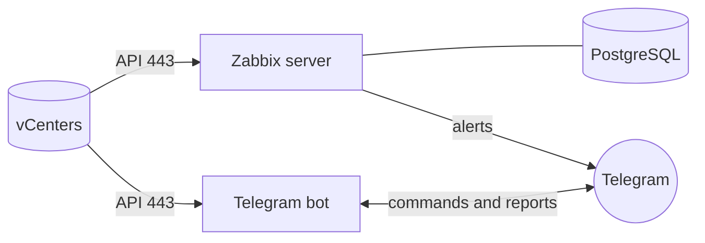

# vCenter Monitoring on Kubernetes

Watch 20+ VMware vCenter servers from a self-hosted Kubernetes cluster.
Alerts and on-demand reports arrive in Telegram.

## Architecture

## Roadmap

- [x] Phase 0: devbox, SSH keys, kubectl and helm, cluster health check, etcd backup
- [ ] Phase 1: Zabbix and PostgreSQL in namespace `vcenter-monitoring`
- [ ] Phase 2: Telegram bot (`/summary`, `/vms`, `/off`, `/storage`)
- [ ] Phase 3: all vCenters, per-owner Excel reports

## Security

No passwords, tokens or real IP addresses live in this repo.
Real values are kept in gitignored `*.local.yaml` / `.env` files and
Kubernetes Secrets. Committed files use placeholders such as `<VCENTER_URL>`.
